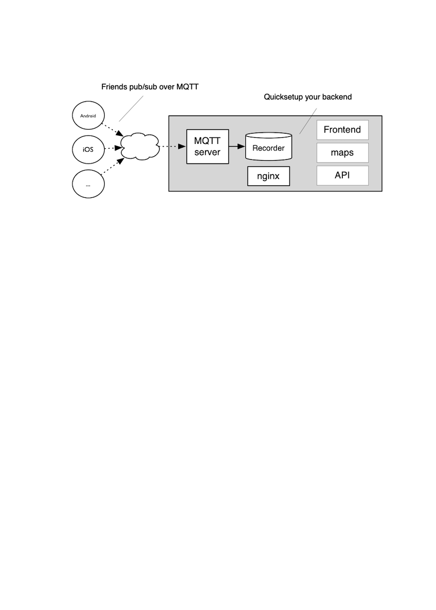

# quicksetup

OwnTracks allows you to keep track of your own location. You can build your private location diary or share it with your family and friends. OwnTracks is open-source and uses open protocols for communication so you can be sure your data stays secure and private.



The components required to use the free OwnTracks apps are non-trivial to setup. For this reason we have created this project: _quicksetup_ is a set of tools which, when run on a suitable small computer or VPS, will should get your OwnTracks environment set up as comfortably as possible.

Quicksetup [is documented in the OwnTracks Booklet](https://owntracks.org/booklet/guide/quicksetup/)

## requirements

- VPS (512MB RAM) with Linux. Debian (12) or Ubuntu (Jammy, Mantic, Noble)
- alternatively, a Raspberry Pi with Raspbian _bookworm_
- a DNS domain name pointing to the Linux machine
- three open TCP ports (80, 443, 8883)

## features

- Let's Encrypt certificate enrollment and renewal (cron)
- MQTT broker (Mosquitto) and HTTP server (Apache) secured with SSL/TLS
- OwnTracks [Recorder](https://github.com/owntracks/recorder)
  - configured for MQTT
  - with support for HTTP POST for location publishes from OwnTracks clients
- configured [Frontend](https://github.com/owntracks/frontend)
- automatic configuration of friends, each of which can see eachother via MQTT in the apps and on Frontend, etc.
- configuration of any number of friends
  - users are created with random passwords added to files in file system, `htpasswd`, and Mosquitto password file
  - users can download pre-configured [.otrc remote configuration files](https://owntracks.org/booklet/features/remoteconfig/) or click on a URL config for ease of configuration of the apps. Preconfigured with choice of MQTT and HTTP
  - optional configuration of a secret key per user for payload encryption
- optional but recommended configuration of [OpenCageData](https://opencagedata.com/) for reverse geo in Recorder defaults file and in `.otrc` for Android devices. (Sign up for [a free account](https://opencagedata.com/users/sign_up) you use with OwnTracks.) Location data is cached by the Recorder and stored alongside location publishes, served from the API
- should be able to support a dozen or more friends on a 512MB VPS
- `mosquitto_pub`/`mosquitto_sub` pre-configured to use local broker with files in `$HOME/.config/`
- `jq(1)` and `jo(1)` commands for working with JSON
- bootstrapping of installation
- Recorder Views (without requiring basic auth)
- support for optional:
   - Recorder Lua script
- explicitly no support for:
   - [MQTT over websockets](https://github.com/owntracks/quicksetup/issues/3), even though our apps support it

## installation

1. Get a copy of all files in this repository:
   1. either install git and clone the repository:
      ```console
      apt install -y git
      git clone https://github.com/owntracks/quicksetup
      cd quicksetup
      ```
   2. or download a copy of the files and extract them:
      ```console
      curl -LO https://github.com/owntracks/quicksetup/archive/master.tar.gz
      tar xf master.tar.gz
      cd quicksetup-main
      ```

2. Make a copy of the [configuration file](configuration.yaml.example) used for setup and edit its content.
   ```console
   cp configuration.yaml.example configuration.yaml
   nano configuration.yaml
   ```

3. Launch the installer which will install packages and configure services.
   ```console
   $ sudo ./bootstrap.sh
   ```

If you later decide you wish to add a friend to `configuration.yaml`, just run the installer again: `./bootstrap.sh`.

